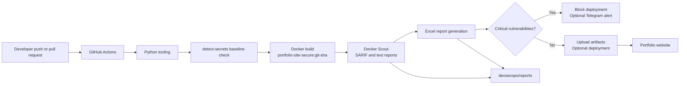
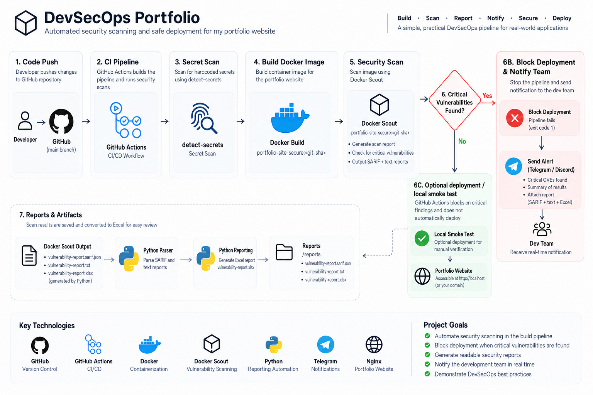

# DevSecOps Portfolio Project

This repository contains a static portfolio website and the DevSecOps workflow around it. I built it as a practical project to show how a code change can move through secret scanning, containerization, vulnerability scanning, reporting, and deployment checks.

## What the project does

- Builds the static website into a small Nginx Docker image.
- Checks tracked files for accidentally committed secrets with `detect-secrets`.
- Scans the image with Docker Scout.
- Converts scan results into SARIF, text, and Excel reports.
- Blocks deployment when critical vulnerabilities are found.
- Sends the Excel report to Telegram when notifications are configured.
- Runs the same checks automatically in GitHub Actions.

The remediated image currently uses `nginx:1.31.5-alpine-slim` pinned by digest. The validation run reported `0C 0H 0M 0L`, returned HTTP 200, and reached a healthy container state.

## Architecture





The local `CICD.sh` script also starts the container after the security check passes. The GitHub Actions workflow builds and checks the image but does not deploy it to production.

## Project notes and evidence

The short project explanation is in [`docs/`](docs/README.md). The remediation notes explain the original vulnerability findings, the base-image update, and the validation result. The screenshots and recommendation record are in [`docs/evidence/`](docs/evidence/README.md).

## Prerequisites

- Python 3.13 or another compatible Python 3 version
- Docker Desktop with the Linux engine running
- Git
- Git Bash for `CICD.sh` on Windows

## Set up the Python environment

Create the virtual environment before installing the project dependencies:

```powershell
python -m venv .venv
.\.venv\Scripts\python.exe -m pip install --upgrade pip
.\.venv\Scripts\python.exe -m pip install -r devsecops\requirements-dev.txt
```

PowerShell activation is optional:

```powershell
.\.venv\Scripts\Activate.ps1
```

Copy `devsecops/.env.example` to `devsecops/.env` only when Telegram notifications are needed. Never commit `.env`.

## Run the secret scan

Create and review the baseline once:

```powershell
cmd /c "detect-secrets scan --all-files > .secrets.baseline"
detect-secrets audit .secrets.baseline
```

Install the local pre-commit hook:

```powershell
pre-commit install
pre-commit run detect-secrets --all-files
```

The baseline records reviewed existing findings. New findings still fail the local hook and the GitHub Actions job.

## Build and run the website

```powershell
docker info
docker build -f devsecops-portfolio\Dockerfile -t portfolio-site-secure:local .
docker run --rm -d --name portfolio-site-secure-local -p 8080:80 portfolio-site-secure:local
```

Open `http://localhost:8080`, or test it from PowerShell:

```powershell
Invoke-WebRequest http://localhost:8080
docker logs portfolio-site-secure-local
docker inspect --format "{{.State.Health.Status}}" portfolio-site-secure-local
```

Stop the container when finished:

```powershell
docker stop portfolio-site-secure-local
```

## Scan the image and create reports

Run the scanner from Git Bash or CI:

```bash
bash devsecops/security-scan.sh portfolio-site-secure:local
```

The generated files are written to `devsecops/reports/`:

- `vulnerability-report.sarif.json`
- `vulnerability-report.txt`
- `base-image-recommendations.txt`
- `critical-exit-code`

Create the Excel report with the virtual-environment interpreter:

```powershell
.\.venv\Scripts\python.exe devsecops\generate-report.py `
  --input devsecops\reports\vulnerability-report.sarif.json `
  --output devsecops\reports\vulnerability-report.xlsx `
  --recommendations devsecops\reports\base-image-recommendations.txt `
  --image portfolio-site-secure:local
```

The workbook includes vulnerability details, a severity summary, scan information, and Docker Scout base-image recommendations. Generated reports are intentionally ignored by Git because they can be recreated from a new scan.

## Run the complete local flow

From Git Bash:

```bash
bash devsecops/CICD.sh
```

The script builds the image, runs the secret and vulnerability checks, creates the reports, sends the optional Telegram notification, and starts the website only when the critical-vulnerability check passes.

## GitHub Actions

The workflow in `.github/workflows/security-pipeline.yml` runs on pull requests and pushes to `main`:

1. Sets up Python and the project tooling.
2. Installs Docker Scout and authenticates to Docker Hub.
3. Checks tracked files for secrets.
4. Builds the image using the commit SHA as its tag.
5. Scans the image and creates reports.
6. Uploads the reports as workflow artifacts.
7. Stops the job if the critical-vulnerability check fails.
8. Sends the Excel report to Telegram when the Telegram secrets are configured.

The workflow does not deploy to production. It verifies that the image is safe enough to continue through the pipeline. The local script is the part that starts a local Docker container.

Add these GitHub repository secrets when needed:

- `DOCKER_HUB_USERNAME`
- `DOCKER_HUB_TOKEN`
- `TELEGRAM_BOT_TOKEN`
- `TELEGRAM_CHAT_ID`

Use a read-only Docker Hub token. Never place any of these values in the repository or in screenshots.

## Development flow

```text
Create virtual environment
        -> install dependencies
        -> run the secret scan
        -> test the website
        -> build the image
        -> scan the image
        -> review the reports
        -> merge only when the security check passes
```

## Troubleshooting

- Docker daemon errors usually mean Docker Desktop is not running or the Linux engine is unavailable.
- On Windows, run `CICD.sh` from Git Bash. PowerShell's `bash` command may open a WSL distro without Docker Desktop integration.
- If the healthcheck is unhealthy, inspect `docker logs portfolio-site-secure-local` and verify that `http://localhost:8080` responds.
- If `detect-secrets` finds a real credential, remove it from the repository, rotate it, and update the baseline only after the credential is no longer present.
