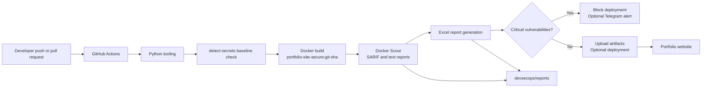

# DevSecOps Portfolio Website

This project demonstrates a small DevSecOps workflow for a static portfolio website. It builds the website into a Docker image, scans the repository for secrets, scans the image with Docker Scout, generates security reports, and blocks deployment when critical vulnerabilities are found.

## Architecture



The existing architecture image is useful as a visual overview, but this diagram is the source of truth for the implementation. The GitHub workflow performs build, scan, reporting, and policy enforcement. The local `CICD.sh` script additionally starts the container after the policy passes.


## Evidence and remediation

Recruiter-facing project evidence is organized under [`docs/`](docs/README.md). The remediation record explains the original vulnerability gate failure, the selected base-image update, and the validation criteria. Screenshots are stored in [`docs/evidence/`](docs/evidence/README.md) with descriptive names.

The security gate is intentionally fail-closed: a critical vulnerability blocks the local deployment and the GitHub Actions job. Remediation means selecting a supported base image, rebuilding the image, rescanning it, and only then accepting the deployment if the critical count is zero.

The current remediated image uses `nginx:1.31.5-alpine-slim` pinned by digest. The validation run produced `0C 0H 0M 0L`, served the site with HTTP 200, and reached a healthy container state. See [`docs/remediation.md`](docs/remediation.md) for the reproducible evidence and remaining improvements.

## Prerequisites

- Python 3.13 or compatible Python 3 version
- Docker Desktop with the Linux engine running
- Git
- Git Bash, WSL, or another Bash-compatible shell for `CICD.sh`

## First-time Python setup

Run these commands from the repository root. Create the virtual environment before installing Python dependencies.

```powershell
python -m venv .venv
.\.venv\Scripts\python.exe -m pip install --upgrade pip
.\.venv\Scripts\python.exe -m pip install -r devsecops\requirements-dev.txt
```

PowerShell activation is optional:

```powershell
.\.venv\Scripts\Activate.ps1
```

Copy `devsecops/.env.example` to `devsecops/.env` only if Telegram notifications are required. Never commit `.env`.

## Secret scanning setup

Create and review the baseline once:

```powershell
cmd /c "detect-secrets scan --all-files > .secrets.baseline"
detect-secrets audit .secrets.baseline
```

Install the local pre-commit hook:

```powershell
pre-commit install
pre-commit run detect-secrets --all-files
```

The baseline is committed so reviewed existing findings do not block every commit. New findings still fail the pre-commit hook and the GitHub Actions job.

## Build and run locally

The Docker image name is `portfolio-site-secure`.

```powershell
docker info
docker build -f devsecops-portfolio\Dockerfile -t portfolio-site-secure:local .
docker run --rm -d --name portfolio-site-secure-local -p 8080:80 portfolio-site-secure:local
```

Test the website:

```powershell
Invoke-WebRequest http://localhost:8080
docker logs portfolio-site-secure-local
docker inspect --format "{{.State.Health.Status}}" portfolio-site-secure-local
```

Stop the container:

```powershell
docker stop portfolio-site-secure-local
```

## Scan the image and generate reports

Run the scanner from Git Bash, WSL, or CI:

```bash
bash devsecops/security-scan.sh portfolio-site-secure:local
```

The reports are written to `devsecops/reports/`:

- `vulnerability-report.sarif.json`
- `vulnerability-report.txt`
- `base-image-recommendations.txt`
- `critical-exit-code`

Generate the Excel summary with the virtual-environment interpreter:

```powershell
.\.venv\Scripts\python.exe devsecops\generate-report.py `
  --input devsecops\reports\vulnerability-report.sarif.json `
  --output devsecops\reports\vulnerability-report.xlsx `
  --recommendations devsecops\reports\base-image-recommendations.txt `
  --image portfolio-site-secure:local
```

The Excel workbook includes a `Recommendations` worksheet populated from Docker Scout's base-image recommendations. These recommendations are advisory; the critical-vulnerability gate remains the deployment decision.

## Complete local pipeline

From Git Bash or WSL:

```bash
bash devsecops/CICD.sh
```

The script builds `portfolio-site-secure:local`, scans it, creates the SARIF, text, and Excel reports, blocks deployment for critical vulnerabilities, and starts the container on `http://localhost:8080` only when the policy passes.

## GitHub Actions

The workflow in `.github/workflows/security-pipeline.yml` runs on pull requests and pushes to `main`:

1. Installs the Python tooling.
2. Checks tracked files with `detect-secrets-hook`.
3. Builds `portfolio-site-secure:<commit-sha>`.
4. Scans the image with Docker Scout.
5. Generates an Excel report.
6. Uploads scan artifacts.
7. Blocks the job when critical vulnerabilities are present.
8. Sends an optional Telegram notification with the Excel report attached when the required GitHub secrets exist.

The workflow installs Docker Scout explicitly because Docker Desktop includes the Scout plugin locally, while a hosted CI runner may need the standalone CLI setup. A push to `main` automatically starts this workflow. A pull request runs the same security checks before merge. This project does not automatically deploy to production; the local script deploys only to the local Docker container after the critical gate passes.

Add these GitHub repository secrets only if Telegram notifications are wanted:

- `TELEGRAM_BOT_TOKEN`
- `TELEGRAM_CHAT_ID`

When a pipeline failure occurs, the notifier attaches `devsecops/reports/vulnerability-report.xlsx`. If that file is unavailable, it sends the failure message without an attachment.

## Development flow

```text
Create virtual environment
        -> install development dependencies
        -> run detect-secrets locally
        -> run application smoke test
        -> build image
        -> scan image
        -> review reports
        -> merge only when the security gate passes
```

## Troubleshooting

- Docker daemon errors usually mean Docker Desktop is not running or the Linux engine is unavailable.
- On Windows, run `CICD.sh` from Git Bash. PowerShell's `bash` command may open a WSL distro without Docker Desktop integration; alternatively enable Docker integration for that distro.
- If the healthcheck is unhealthy, inspect `docker logs portfolio-site-secure-local` and verify that `http://localhost:8080` responds.
- If `detect-secrets` reports a real credential, remove it from the repository, rotate it, and update the baseline only after the credential is no longer present.
